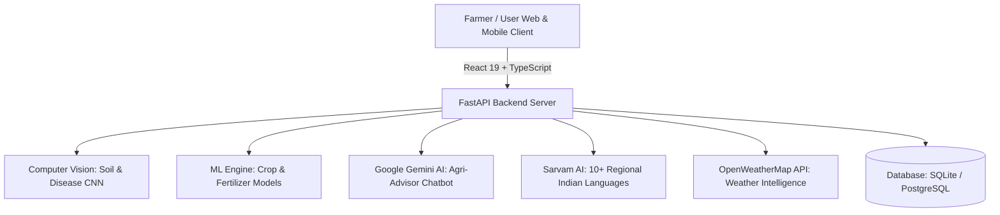

# 🌾 AgroAI: AI-Based Soil Health Assessment System

An enterprise-grade, fullstack agricultural intelligence platform engineered to assess soil health, detect macro/micro-nutrient deficiencies via computer vision, recommend optimal crops and customized fertilizer schedules, provide hyper-local weather analytics, and assist farmers in regional Indian languages through an AI-powered multilingual chatbot.

---

## 📑 Table of Contents

- [Overview & Architecture](#-overview--architecture)
- [Key Features](#-key-features)
- [Technology Stack](#-technology-stack)
- [Project Directory Layout](#-project-directory-layout)
- [Prerequisites](#-prerequisites)
- [Local Setup & Installation](#-local-setup--installation)
  - [1. Clone Repository](#1-clone-repository)
  - [2. Backend Setup](#2-backend-setup)
  - [3. Frontend Setup](#3-frontend-setup)
- [Configuration (.env Guide)](#-configuration-env-guide)
- [Default Login Credentials](#-default-login-credentials)
- [Running the Application](#-running-the-application)
- [Cloud & Production Deployment (Render)](#-cloud--production-deployment-render)
- [API Documentation & Swagger UI](#-api-documentation--swagger-ui)
- [Documentation Suite](#-documentation-suite)

---

## 🏗️ Overview & Architecture

AgroAI unites computer vision (EfficientNet-B0), machine learning (CatBoost, Random Forest), large language models (Google Gemini), and regional Indian language localization (Sarvam AI) into a unified, accessible web application tailored for farmers and agricultural administrators.



---

## ✨ Key Features

1. **🔬 AI Soil Classification**: Upload a soil image to automatically classify soil type (Black, Red, Clay, Sandy, Alluvial, Loamy) with real-time confidence scores and quality validation (blur, lighting, resolution checks).
2. **🌱 Precision Crop Recommendation**: Generates tailored crop recommendations based on soil health metrics (N-P-K levels, pH, moisture, temperature, rainfall, and geographic region).
3. **🧪 Fertilizer & Nutrient Advisory**: Identifies specific nutrient deficiencies (Nitrogen, Phosphorus, Potassium, etc.) and provides stage-by-stage application dosages and organic alternatives.
4. **🌦️ Hyper-Local Weather Intelligence**: 5-day forecasts and real-time agricultural weather metrics (temperature, humidity, wind speed, precipitation, UV index, visibility).
5. **🤖 Multilingual Agri-Chatbot**: Powered by Google Gemini with voice input and audio text-to-speech (TTS) in regional languages (Hindi, Telugu, Tamil, Kannada, Marathi, Punjabi, Bengali, Gujarati, Odia, Malayalam, etc.).
6. **📊 Farmer & Admin Dashboards**:
   - **Farmer Dashboard**: Soil health scores, crop analytics, weather cards, prediction history, PDF report export.
   - **Admin Portal**: User management, platform analytics, system health monitors, and farmer feedback review & response system.
7. **🗣️ Farmer Community & Feedback System**: Direct review submission from farmers with an interactive admin response & resolution workflow.

---

## 💻 Technology Stack

| Layer | Technologies |
| :--- | :--- |
| **Frontend** | React 19, TypeScript, Vite, TailwindCSS, Lucide Icons, Recharts |
| **Backend API** | Python 3.10+, FastAPI, Uvicorn, Pydantic v2, SQLAlchemy 2.0 |
| **Database** | SQLite (Development) / PostgreSQL (Production) |
| **Machine Learning & AI** | TensorFlow / Keras, Scikit-learn, CatBoost, Google Gemini API, Sarvam AI |
| **Security** | JWT (JSON Web Tokens), Bcrypt Password Hashing, Role-Based Access Control (RBAC) |
| **Localization** | Sarvam AI Translation & Transliteration (Hindi, Telugu, Tamil, Kannada, etc.) |

---

## 📁 Project Directory Layout

```
AI-Based-Soil-Health-Assessment-System/
├── app/                                  # Main FastAPI Backend Application
│   ├── routes/                           # REST API Route Endpoints
│   │   ├── auth_routes.py                # Login, Register, Profile, Password Management
│   │   ├── admin_dashboard.py            # Admin Statistics & Insights
│   │   ├── crop_routes.py                # Crop Recommendation Routes
│   │   ├── feedback_routes.py            # Feedback Submission & Admin Reply
│   │   ├── history_routes.py             # Farmer Prediction History
│   │   ├── prediction_routes.py          # Soil Classification & Image Inference
│   │   ├── weather_routes.py             # Weather Forecast & Current Conditions
│   │   └── translation_routes.py         # Sarvam AI Translation Proxy
│   ├── services/                         # Core Business Logic & External Integrations
│   │   ├── gemini_service.py             # Google Gemini AI Integration
│   │   ├── sarvam_service.py             # Sarvam AI Translation & TTS Integration
│   │   ├── weather_service.py            # OpenWeatherMap Integration
│   │   └── history_service.py            # Database Prediction Audit Log Service
│   ├── auth.py                           # User Authentication Functions
│   ├── config.py                         # Application Settings & .env Configuration
│   ├── database.py                       # SQLAlchemy Engine & Session Factory
│   ├── models.py                         # Database Table ORM Models
│   ├── schemas.py                        # Pydantic Request & Response Models
│   ├── security.py                       # Password Hashing & Bcrypt Helpers
│   └── main.py                           # FastAPI Entrypoint & Unified Static SPA Server
├── AI-Based-Soil-Health-Assessment-System-for-Nutrient-Deficiency-Detection-and-Crop-Recom_Jun_2026-frontend-team-1/
│   ├── src/                              # React Frontend Source Code
│   │   ├── components/                   # Reusable UI Components & Modals
│   │   ├── pages/                        # Page Views (Dashboard, Weather, AIModules, etc.)
│   │   ├── services/                     # Frontend API Client (api.ts, sarvamClient.ts)
│   │   ├── translations/                 # Localization Resource Dictionaries
│   │   └── App.tsx                       # Main Application Component
│   ├── package.json                      # Frontend Dependencies & Build Scripts
│   └── vite.config.ts                    # Vite Build Configuration
├── dist/                                 # Compiled Production Frontend Bundle
├── docs/                                 # Detailed Architecture & Deployment Documentation
├── seed_users.py                         # Default Accounts & Language Seeder
├── requirements.txt                      # Backend Production Python Dependencies
├── .env.example                          # Environment Variables Configuration Template
└── README.md                             # Project Documentation (This File)
```

---

## ⚙️ Prerequisites

Before running the project locally, ensure you have:
* **Python**: `3.10` or higher
* **Node.js**: `v18.0.0` or higher & `npm`
* **Git**: Installed and configured

---

## 🚀 Local Setup & Installation

### 1. Clone Repository

```bash
git clone https://github.com/AbdulRajak-Shaik/Infosys-Project.git
cd Infosys-Project
```

### 2. Backend Setup

1. **Create and activate a Python virtual environment**:
   ```bash
   # Windows (PowerShell):
   python -m venv venv
   .\venv\Scripts\Activate.ps1

   # Linux / macOS:
   python3 -m venv venv
   source venv/bin/activate
   ```

2. **Install Python dependencies**:
   ```bash
   pip install -r requirements.txt
   ```

3. **Configure Environment Variables**:
   ```bash
   cp .env.example .env
   ```
   *(Edit `.env` to supply your API keys if you have them, or use the default offline fallbacks).*

4. **Initialize & Seed the Database**:
   ```bash
   python seed_users.py
   ```

### 3. Frontend Setup

1. **Navigate to the frontend directory**:
   ```bash
   cd AI-Based-Soil-Health-Assessment-System-for-Nutrient-Deficiency-Detection-and-Crop-Recom_Jun_2026-frontend-team-1
   ```

2. **Install Node modules**:
   ```bash
   npm install
   ```

3. **Build or Start Development Server**:
   ```bash
   # Run frontend in development mode:
   npm run dev

   # Or compile production bundle:
   npm run build
   ```

---

## 🔑 Configuration (.env Guide)

A template `.env.example` is provided in the repository root. Key parameters:

| Variable | Description | Default / Example |
| :--- | :--- | :--- |
| `DATABASE_URL` | Database connection string | `sqlite:///./soil_health.db` |
| `JWT_SECRET_KEY` | Secret key used for signing JWT access tokens | Random 256-bit hex string |
| `JWT_REFRESH_SECRET_KEY` | Secret key used for refresh tokens | Random 256-bit hex string |
| `GEMINI_API_KEY_1` | Google Gemini API key for Chatbot & Recommendations | `AQ.Ab8...` |
| `SARVAM_API_KEY` | Sarvam AI API key for regional language translation | `sk_...` *(or leave blank for dictionary)* |
| `OPENWEATHER_API_KEY` | OpenWeatherMap API key for live weather data | *(Optional / Fallback available)* |

---

## 👤 Default Login Credentials

The application automatically seeds standard test accounts on initial startup:

| Role | Email | Password | Description |
| :--- | :--- | :--- | :--- |
| **System Administrator** | `admin@agroai.com` | `Admin@123` | Full access to Admin Portal, Analytics, User Management & Feedback |
| **Registered Farmer** | `sar@gmail.com` | `Sar@1234` | Access to Soil Health Analysis, Crop Recommendations & Community |
| **Demo Farmer** | `farmer@agroai.com` | `Farmer@123` | Demo farmer account with sample prediction history |

---

## ▶️ Running the Application

### Option A: Unified Fullstack Mode (Recommended)
FastAPI automatically serves the production frontend from the `dist/` directory on port 8000:

```bash
# Start backend & static SPA server:
uvicorn app.main:app --host 0.0.0.0 --port 8000
```
Open **[http://localhost:8000](http://localhost:8000)** in your browser.

### Option B: Separate Development Servers
- **Backend API**: `uvicorn app.main:app --reload --port 8000` (Running at `http://localhost:8000`)
- **Frontend Dev Server**: `cd <frontend-dir> && npm run dev` (Running at `http://localhost:5173`)

---

## ☁️ Cloud & Production Deployment (Render)

When deploying to [Render](https://render.com/) as a Python Web Service:

1. **Repository**: `https://github.com/AbdulRajak-Shaik/Infosys-Project.git`
2. **Branch**: `complete-integration`
3. **Environment**: `Python`
4. **Build Command**:
   ```bash
   pip install -r requirements.txt && cd AI-Based-Soil-Health-Assessment-System-for-Nutrient-Deficiency-Detection-and-Crop-Recom_Jun_2026-frontend-team-1 && npm install && npm run build && cd ..
   ```
5. **Start Command**:
   ```bash
   uvicorn app.main:app --host 0.0.0.0 --port $PORT
   ```
6. **Environment Variables**:
   - `DATABASE_URL` = *(Your PostgreSQL connection string or leave blank for SQLite)*
   - `JWT_SECRET_KEY` = *(Your secret key)*
   - `JWT_REFRESH_SECRET_KEY` = *(Your refresh secret key)*
   - `GEMINI_API_KEY_1` = *(Your Google Gemini key)*
   - `SARVAM_API_KEY` = *(Your Sarvam AI key)*
   - `OPENWEATHER_API_KEY` = *(Your OpenWeatherMap key)*

---

## 📖 API Documentation & Swagger UI

FastAPI provides interactive API documentation out-of-the-box:

* **Interactive Swagger UI**: `http://localhost:8000/docs`
* **ReDoc Documentation**: `http://localhost:8000/redoc`
* **OpenAPI Specification**: `http://localhost:8000/openapi.json`

---

## 📚 Documentation Suite

For further deep-dive guides, refer to the [`docs/`](docs/) directory:
* **[Installation Guide](docs/installation_guide.md)** — Step-by-step local developer setup
* **[Deployment Guide](docs/deployment_guide.md)** — Production server & Nginx configuration
* **[API Documentation](docs/api_documentation.md)** — Comprehensive REST API endpoint definitions
* **[Database Schema Overview](docs/database_schema_overview.md)** — Relational database models and fields
* **[User Manual](docs/user_manual.md)** — Farmer user guide for soil analysis & crop advisor
* **[Admin Manual](docs/admin_manual.md)** — Administrator monitoring & management manual
* **[Troubleshooting Guide](docs/troubleshooting_guide.md)** — Common error resolution & FAQs

---

## 📄 License & Credits

Developed for the **AI-Based Soil Health Assessment System for Nutrient Deficiency Detection and Crop Recommendation** Project.
